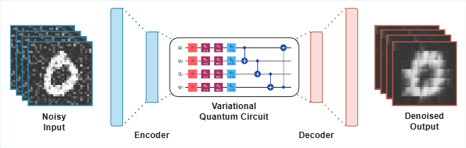

<p align="center">
    <br>
    <h3 align="center">Hybrid classical–quantum image denoising with Variational Quantum Algorithms</h3>
    <p align="center">
        Quantum Programming and Platforms final project.
        <br>
        <a href="https://github.com/martabenavente/VQE-Image-denoising/issues/new?template=bug.md">Report bug</a>
        ·
        <a href="https://github.com/martabenavente/VQE-Image-denoising/issues/new?template=feature.md&labels=feature">Request feature</a>
    </p>
</p>

> [!IMPORTANT]
> The final version of the report is available online at https://www.overleaf.com/read/kxydwfxdhqqn#8e4338

<!-- TABLE OF CONTENTS -->
<details>
  <summary>Table of Contents</summary>
  <ol>
    <li><a href="#project-overview">Project overview</a></li>
    <li><a href="#repository-structure">Repository structure</a></li>
    <li><a href="#environment-setup">Environment setup</a></li>
    <li><a href="#how-to-run">How to run</a></li>
    <li><a href="#input-and-output-data">Input and output data</a></li>
    <li><a href="#team-members">Team Members</a></li>
    <li><a href="#license">License</a></li>
  </ol>
</details>


## Project overview

This repository contains code and experiments for a hybrid classical–quantum approach to image denoising based on a variational quantum circuit embedded in a learning pipeline.

The project focuses on:
- Training behaviour and stability of the variational optimisation process.
- Denoising performance under different noise levels and model configurations.
- Comparison against a purely classical baseline.


## Repository structure

The project's file structure is organized as follows:

```
├── VQE-Image-denoising/
│   ├── examples/
│   │   ├── load_data_example.py
│   │   ├── ...
│   ├── report/
│   │   ├── Hybrid Classical-Quantum Autoencoder for Image Denoising.pdf
│   ├── src/
│   │   ├── __init__.py
│   │   ├── noise_generation.py
│   │   ├── ...
│   ├── tests/
│   │   ├── test_noise_generation.py
│   │   ├── ...
│   ├── tools/
│   │   ├── plot_wandb_metrics.py
│   │   ├── ...
│   ├── .gitingore
│   ├── README.md
│   ├── environment.yml
│   ├── ...
```

## Environment setup

### Conda

```bash
conda env create -f environment.yml
conda activate vqe-denoising
```

### Pip
```bash
pip install -r requirements.txt
```

## How to run

The easiest way to run the project is through the files in examples/, which provide end-to-end execution of training and evaluation pipelines.

General workflow:
  1. Load/preprocess the dataset.
  2. Apply noise to the inputs.
  3. Train the hybrid model and/or baseline.
  4. Evaluate denoising performance with standard metrics.

This repository includes a ready-to-use training script that runs the full hybrid quantum–classical denoising pipeline. From the project root, run:

```bash
python -m src.train_model
```


## Input and output data

### Input
- Dataset: MNIST.
- Noise level: Gaussian noise with mean = 0 and standard deviation = 0.2.

### Output
- Denoised images from both models (hybrid and baseline).
- Metrics such as PSNR, SSIM, etc., comparing the original clean images with their noisy counterparts and the denoised ones obtained by each model.

## Model architecture

<p align="center">
  
</p>

## Team Members

1. **Yeray Cordero**
   - GitHub: <https://github.com/yeray142/>
   - LinkedIn: <https://linkedin.com/in/yeray142/>

2. **Marta Benavente**
   - GitHub: <https://github.com/martabenavente>
   - LinkedIn: <https://www.linkedin.com/in/marta-benavente-vilas-5330532a7/>

## License

Distributed under the MIT License. See `LICENSE` for more information.
